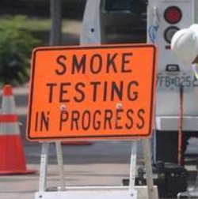

# smoketests

Some simple smoketests that can be run by Ansible to verify a site is loading.

## Requirements

none

## Role Variables

optional (see Defaults)

## Dependencies

none

## Examples

* Defaults

If you don't define any variables, this playbook will use the defaults found in `defaults/main.yml`

```
---
smoketests_host: "{{ ansible_fqdn }}"
smoketests_path: "/"
smoketests_port: "443"
smoketests_status: "200"
smoketests_content: "Copyright"
smoketests_protocol: "https"
```

* Usage

To run the smoketests with the default variables, just include it as a role

```
    - hosts: servers
      roles:
         - smoketests
```

* Override

If you want to override a default variable (likely), pass it as a parameter to the role:

```
roles:
   - { role: smoketests, smoketests_path: "/solr", smoketests_content: "Apache" }
```

<div align="center"></div>


## License

[BSD 2-Clause](https://github.com/philcryer/smoketests/blob/master/LICENSE)

## Author Information

[philcryer](https://github.com/philcryer)

Thanks
